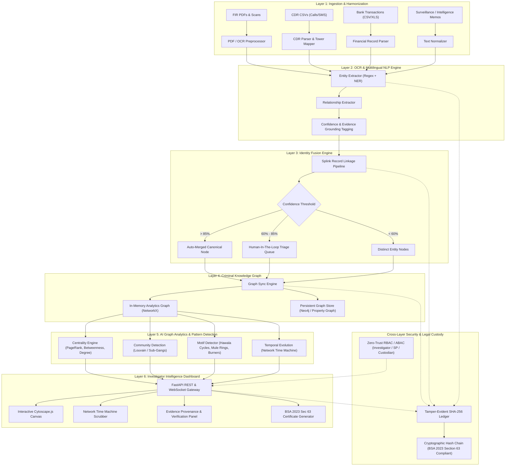

# System Architecture: CRIMEGRAPH AI

**System:** AI-Powered Criminal Network Analysis Platform
**Target Organization:** Ministry of Home Affairs (NCRB), Govt. of India
**Problem Statement ID:** 26189
**Theme:** Blockchain & Cybersecurity

---

## 1. High-Level Architectural Overview

CRIMEGRAPH AI employs a **6-Layer Decoupled Intelligence Architecture** engineered for air-gapped on-premise police deployments, high-throughput graph analytics, and strict judicial evidence standards under the Bharatiya Sakshya Adhiniyam (BSA), 2023.



---

## 2. Detailed Layer Specifications

### Layer 1: Ingestion & Harmonization

- **Purpose:** Accept heterogeneous structured and unstructured police inputs, clean dirty data, standardize timestamps to ISO 8601 UTC, and convert all records into unified raw JSON envelopes.
- **Components:**
  - `PDFParser`: Uses PyMuPDF / pdfplumber with OCR fallback (Tesseract).
  - `CDRParser`: Cleans country codes, detects IMEI/IMSI pairs, parses call durations, maps tower IDs to lat/longs.
  - `BankParser`: Normalizes sender/receiver accounts, parses transaction types (IMPS/NEFT/RTGS/UPI), extracts UTRs.
- **Provenance Registration:** Calculates source document SHA-256 hash immediately upon upload and logs it to the Tamper-Evident Ledger.

### Layer 2: Extraction & Multilingual NLP Engine

- **Purpose:** Discovers named entities and relationships from raw text, associating every extracted item with its exact character start/end offsets.
- **Rule-based & Regex Extractors:**
  - Phone: `(?:\+91|0)?[6-9]\d{9}`
  - Vehicle: `[A-Z]{2}[0-9]{1,2}[A-Z]{1,3}[0-9]{4}`
  - IFSC: `^[A-Z]{4}0[A-Z0-9]{6}$`
  - Pan / Aadhaar (Masked format): `[A-Z]{5}[0-9]{4}[A-Z]{1}`
- **NER Model:** Fine-tuned Transformer / spaCy pipeline for Indian crime context recognizing suspects, aliases, addresses, and IPC/BNS crime sections.
- **Output Schema:**
  ```json
  {
    "entity_id": "ENT-9021",
    "type": "PERSON",
    "raw_value": "Vicky @ Vikram Malhotra",
    "canonical_candidate": "Vikram Malhotra",
    "aliases": ["Vicky", "Malhotra"],
    "evidence_ref": {
      "doc_id": "FIR-2024-889.pdf",
      "doc_sha256": "8f4a...e12a",
      "page": 2,
      "char_span": [412, 435],
      "confidence": 0.94
    }
  }
  ```

### Layer 3: Identity Fusion Engine (Splink & Fellegi-Sunter)

- **Purpose:** Criminals frequently change spellings, use nicknames, or share burner devices to avoid detection. This layer calculates match probabilities across fragmented records.
- **Techniques:**
  - **Phonetic Encoding:** Double Metaphone and Soundex tailored for Indian naming variations (e.g., *Suresh*, *Sures*, *Sooresh*).
  - **Jaro-Winkler & Levenshtein:** Edit distance calculation for aliases and residential addresses.
  - **Graph Co-occurrence Weighting:** If two names share the same phone number or co-accused associates, the match probability increases exponentially.
- **Tri-State Resolution:**
  - `Merge`: High-confidence match ($P \ge 0.85$). Nodes merged into a canonical entity with unified history.
  - `Investigator Triage`: Moderate-confidence ($0.60 \le P < 0.85$). Sent to the dashboard with comparison diff for IO confirmation.
  - `Isolate`: Low-confidence ($P < 0.60$). Preserved as separate entities.

### Layer 4: Criminal Knowledge Graph Schema

The graph is maintained in a **Hybrid Architecture**:

1. **NetworkX (In-Memory Engine):** Powers instant algorithmic processing (PageRank, Betweenness, Shortest Paths, Motifs) with microsecond latency.
2. **Neo4j / Property Graph Store:** Provides ACID-compliant persistence, Cypher querying, and enterprise scalability.

#### Node Entities & Properties:

- `Suspect`: `{ id, name, aliases, gender, risk_score, bns_sections, status }`
- `PhoneNumber`: `{ id, msisdn, imei, imsi, telecom_circle, is_burner }`
- `BankAccount`: `{ id, account_no, bank_name, ifsc, is_mule, balance }`
- `Vehicle`: `{ id, reg_no, vehicle_type, model, color }`
- `Location`: `{ id, name, lat, lng, district, address }`
- `CrimeIncident`: `{ id, fir_no, police_station, incident_date, ipc_sections }`

#### Relationship Types & Properties:

- `(:Suspect)-[:ASSOCIATED_WITH { role, confidence, evidence_id }]->(:Suspect)`
- `(:Suspect)-[:USES_PHONE { since, until, is_primary }]->(:PhoneNumber)`
- `(:PhoneNumber)-[:CALLED { frequency, total_duration_sec, first_call, last_call }]->(:PhoneNumber)`
- `(:Suspect)-[:OPERATES_ACCOUNT { access_type }]->(:BankAccount)`
- `(:BankAccount)-[:TRANSFERRED { tx_id, amount_inr, timestamp, channel }]->(:BankAccount)`
- `(:Suspect)-[:ACCUSED_IN { role_in_crime }]->(:CrimeIncident)`
- `(:Suspect)-[:CO_LOCATED_AT { timestamp, duration_minutes, tower_id }]->(:Location)`

### Layer 5: AI Graph Analytics & Pattern Detection

- **Betweenness Centrality:** Detects the critical brokers / Hawala couriers bridging two criminal cells. Neutralizing these nodes disrupts communication lines.
- **PageRank:** Identifies the true syndicate masterminds who stay distant from field operations but receive indirect loyalty, coordination, and fund streams.
- **Louvain Modularity:** Segregates the overarching syndicate into operational sub-cliques (e.g., procurement cell, extortion muscle, financial laundering cell).
- **Network Time Machine Engine:**
  - Filters nodes and edges by active timestamps:
    $$
    \mathcal{G}(t_1, t_2) = (V_{t \in [t_1, t_2]}, E_{t \in [t_1, t_2]})
    $$
  - Investigators drag the slider to observe how a small 2-man fraud cell metastasized into a multi-city syndicate over 6 months.
- **Suspicious Motifs:**
  - *Hawala Loop:* $A \xrightarrow{₹5L} B \xrightarrow{₹4.8L} C \xrightarrow{₹4.7L} A$
  - *Smurfing:* 20 micro-transfers of ₹49,000 to avoid ₹50,000 threshold, consolidating into a single account.

### Layer 6: Investigator Intelligence Dashboard & API Layer

- **Backend:** FastAPI with Pydantic v2 data models, asynchronous endpoints, and streaming JSON/WebSocket channels.
- **Frontend:** React + TypeScript + Vite + Tailwind CSS + Cytoscape.js.
  - Custom dark theme optimized for forensic intelligence analysts.
  - Interactive graph canvas with layout physics (CoSE-Bilkent, concentric, circle).
  - Node filtering by risk tier, entity type, and date range.
  - Double-click on any edge opens the **Evidence Grounding Drawer** with source text highlights.

---

## 3. Legal Integrity & Tamper-Evident Audit Chain (BSA 2023)

Under Section 63 of the Bharatiya Sakshya Adhiniyam, 2023, electronic evidence requires verification of lawful custody and tamper-free processing.

### Cryptographic Hash-Chaining Specification:

```
Block 0 (Genesis):
  Hash = SHA256("GENESIS-BLOCK-MHA-CRIMEGRAPH")

Block N:
  Data = {
    index: N,
    timestamp: "2026-09-23T01:30:00Z",
    officer_id: "IO_KUMAR_782",
    action: "INGEST_EVIDENCE" | "MERGE_ENTITY" | "CENTRALITY_QUERY",
    target_id: "ENT-9021",
    payload_hash: SHA256(payload),
    prev_hash: Hash(Block N-1)
  }
  Hash = SHA256(Data + prev_hash)
```

Any retroactive modification of evidence, suspects, or links breaks the mathematical hash chain instantly.

---

## 4. System Directory & Monorepo Layout

```
d:\sih pro2\
├── docs/                      # Architectural & Engineering Specifications
├── .cursor/rules/             # Agentic rules for strict vibe coding
├── .github/workflows/         # DevSecOps CI/CD pipelines
├── backend/                   # Python FastAPI Backend
│   ├── app/
│   │   ├── api/               # API routes (ingest, graph, analytics, audit)
│   │   ├── core/              # Config, security, logging
│   │   ├── engines/           # Ingestion, NLP, Splink fusion, Graph analytics
│   │   ├── models/            # Pydantic schemas & Graph entities
│   │   ├── storage/           # In-memory graph, Neo4j driver, Audit ledger
│   │   └── main.py            # FastAPI application entrypoint
│   ├── tests/                 # Unit & integration test suites
│   ├── requirements.txt       # Python dependencies
│   └── Dockerfile             # Hardened container image
├── frontend/                  # React + TypeScript + Vite Frontend
│   ├── src/
│   │   ├── components/        # GraphCanvas, TimeSlider, EvidenceDrawer, TopNav
│   │   ├── features/          # Analytics, Ingestion, AuditLedger
│   │   ├── services/          # API client & WebSocket hooks
│   │   ├── types/             # Graph & entity TypeScript interfaces
│   │   └── App.tsx            # Main intelligence workstation UI
│   ├── package.json
│   ├── tailwind.config.js
│   └── vite.config.ts
└── data/                      # Synthetic demo datasets (Operation Chakra-Net)
    ├── raw/                   # Sample FIRs, CDRs, Bank sheets
    └── processed/             # Parsed nodes, edges, and test cases
```
